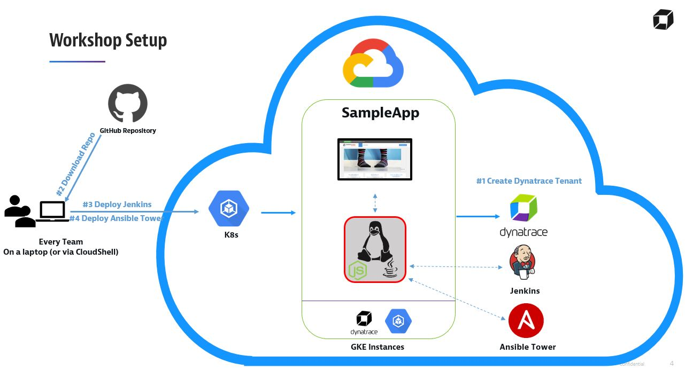

# Dynatrace ACM Workshop (2026 refresh — GKE)

Unbreakable DevOps Pipeline tutorial with self-healing, using **Kubernetes (GKE)**, **Jenkins**, **JMeter**, **AWX** (modern Ansible), and **Dynatrace**.

> This is a modernized copy of the original 2021 [`dynatrace-acm/dtacmworkshop`](https://github.com/dynatrace-acm/dtacmworkshop). It targets **Google Kubernetes Engine only** and replaces the deprecated components so the workshop can run again. See [MIGRATION-NOTES.md](MIGRATION-NOTES.md) for everything that changed and the known risks.

The pipeline delivers four use cases:
1. **FullStack** monitoring of your **Staging** (dev) environment
2. **Shift-Left**: automatic approve/reject promotion Staging→Production based on Dynatrace quality gates
3. **FullStack** monitoring of your **Production** environment
4. **Self-Healing**: automatic remediation in Production when Dynatrace detects a problem (via AWX)

## Pre-Requisites
1. A **Google Cloud** account with billing, and access to **Google Cloud Shell** (recommended — it already has `gcloud`, `kubectl`, `helm`, `jq`, and `git`).
2. A **Dynatrace** SaaS tenant. [Free trial here](https://www.dynatrace.com/trial/).
3. Tooling if you are NOT using Cloud Shell: `gcloud`, `kubectl` ≥ 1.28, `helm` 3, `jq`.

### Dynatrace tokens you need
The modern Dynatrace Operator uses two tokens (create under **Access Tokens** in your tenant):

| Token | Purpose | Required scopes |
|-------|---------|-----------------|
| **API / Operator token** | operator + DynaKube + self-healing playbooks | `Create ActiveGate tokens`, `Read entities`, `Read settings`, `Write settings`, `Access problem and event feed, metrics, and topology`, `Read configuration`, `Write configuration`, `Ingest events` |
| **Data ingest token** | metrics/logs/traces ingest | `Ingest metrics`, `Ingest logs`, `Ingest OpenTelemetry traces` |

(You can also supply an optional legacy PaaS token; it is not required for the operator.)

## Quick start
Run each numbered folder in order **from inside that folder** (scripts use relative paths):

```bash
# 1. Enter your Dynatrace credentials -> writes 1-Credentials/creds.json
cd 1-Credentials && bash defineCredentials.sh && cd ..

# 2. Create the GKE cluster + Dynatrace Operator (DynaKube) + SockShop app
cd 2-CreateCluster && bash setupenv.sh && cd ..

# 3. Deploy Jenkins and the DeploySockShop pipeline job
cd 3-DeployJenkins && bash deployJenkins.sh && cd ..

# 4. Deploy AWX and configure the self-healing job templates
cd 4-DeployTower && bash deployTower.sh && cd ..
```

Cluster/zone/size are overridable via env vars, e.g.:
```bash
GKE_ZONE=europe-west1-b GKE_MACHINE_TYPE=e2-standard-4 bash setupenv.sh
```

### Self-healing wiring (manual step)
`configureAnsible.sh` prints an AWX remediation launch URL like:
```
http://<AWX_IP>/api/v2/job_templates/<id>/launch/
```
In Dynatrace, create a **Problem notification → Ansible/AWX (or custom webhook)** pointing at that URL, authenticated with the AWX `admin` credentials. When Dynatrace opens a problem on the `carts` service in production, AWX runs `playbooks/remediation.yaml`.

## Cleanup
```bash
cd 5-Cleanup
bash cleanup.sh     # remove in-cluster objects, keep the GKE cluster
bash deleteAll.sh   # delete the entire GKE cluster
```

## Architecture


*(The diagram shows the original topology; the standalone ActiveGate VM is gone — the DynaKube now runs an embedded ActiveGate inside the cluster.)*

## Known risks / external dependencies
These are outside this repo's control and may need attention when you run it — details in [MIGRATION-NOTES.md](MIGRATION-NOTES.md):
- **Custom demo images** from 2019-2021 (`wmsegar/jenkins`, `dynatracesockshop/*`, `wmsegar/carts`) are pulled from Docker Hub as-is. If any are removed or fail to run they must be rebuilt from their (external) sources.
- The **Jenkins pipeline** relies on Kubernetes pod templates baked into `wmsegar/jenkins:5.0`; plugin versions there are old.
- The self-healing **playbooks** call classic Dynatrace `api/v1/problem` / `api/v1/events` endpoints; confirm your tenant/token still allows them.
- If you modify manifests or playbooks, push to your own fork and point AWX (and `manifests/prodload`) at it via `WORKSHOP_REPO_URL` / `WORKSHOP_REPO_BRANCH`.

More detailed slides: [DynatraceACM.pptx](DynatraceACM.pptx).
